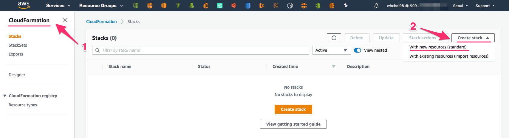
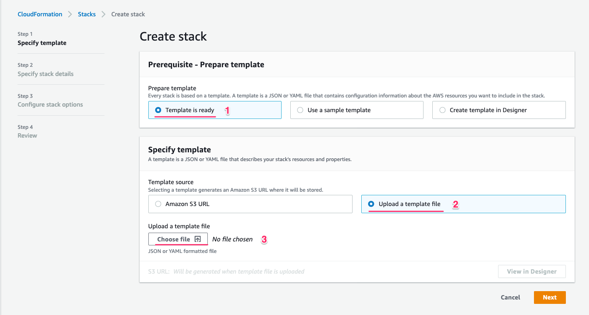
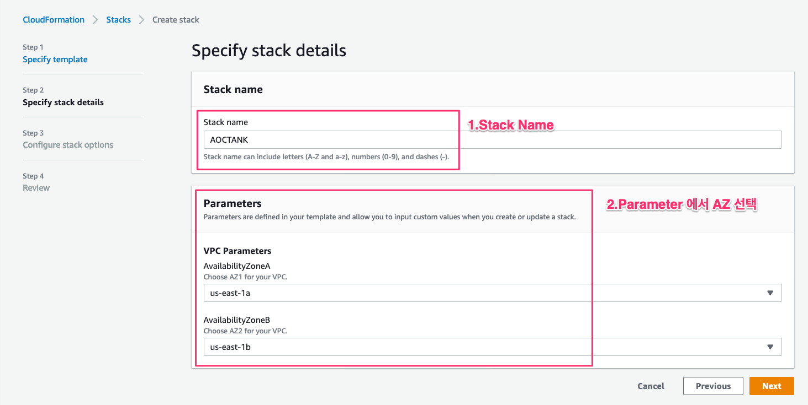
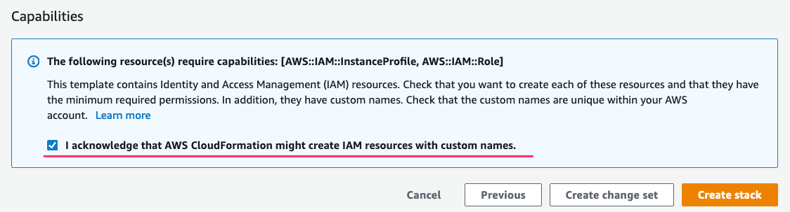
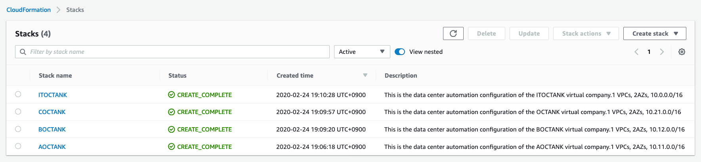
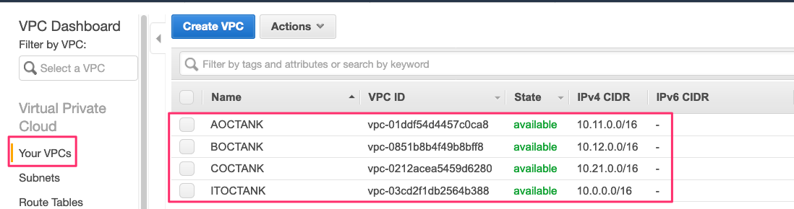
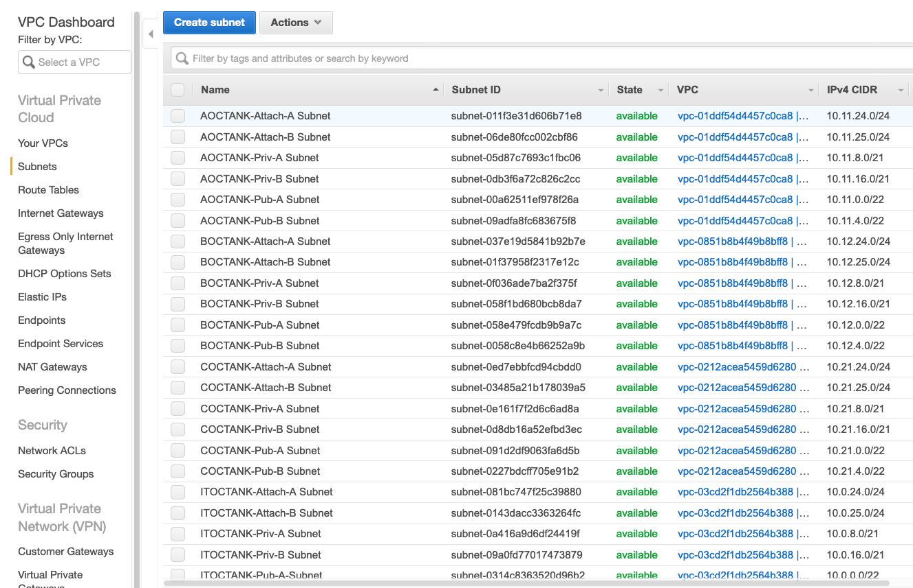
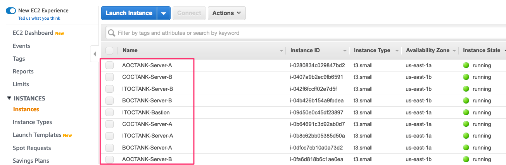

# 1.2 TGW를 위한 VPC 구성

### Transit Gateway 구성 소개

Transit Gateway 구성을 위해 아래와 같은 Topology를  Cloudformation을 통해 구성합니다.

![\[ &#xD654;&#xBA74;&#xC744; &#xD074;&#xB9AD;&#xD558;&#xBA74; &#xD655;&#xB300;&#xD558;&#xC5EC; &#xBCF4;&#xC2E4; &#xC218; &#xC788;&#xC2B5;&#xB2C8;&#xB2E4;.\]](../.gitbook/assets/topology.png)

#### 1. Account A / US- EAST-1- VPC : IT OCTANK


IT OCTANK VPC는 F OCTANK VPC를 제외한 모든 VPC 자원들의 인터넷 트래픽을 NAT Gateway를 통해서 처리합니다. 이러한 구성을 통해 엔터프라이즈 기업은 중복된 NAT Gateway 처리 또는 복잡한 환경을 구성할 필요가 없습니다.


* VPC 구성 요약

| VPC | Account | Region | IGW | NAT G.W | VPC Endpoint | CIDR |
| :--- | :--- | :--- | :--- | :--- | :--- | :--- |
| ITOCTANK | A | US-EAST-1 | O | O | O | 10.0.0.0/16 |

* 네트워크 구성 요약

<table>
  <thead>
    <tr>
      <th style="text-align:left">Public Subnet</th>
      <th style="text-align:left">Private Subnet</th>
      <th style="text-align:left">Attach Subnet</th>
    </tr>
  </thead>
  <tbody>
    <tr>
      <td style="text-align:left">
        <p>A 10.0.0.0/22</p>
        <p>B 10.0.4.0/22</p>
      </td>
      <td style="text-align:left">
        <p>A 10.0.8.0/21</p>
        <p>B 10.0.16.0/21</p>
      </td>
      <td style="text-align:left">
        <p>A 10.0.24.0/24</p>
        <p>B 10.0.25.0/24</p>
      </td>
    </tr>
  </tbody>
</table>* Routing Table 구성요약

| Routing Table Name | Prefix | NextHop | 비고 |
| :--- | :--- | :--- | :--- |
| Local RT | 10.0.0.0/16 | Local |  |
| ITOCTANK Public RT | 0.0.0.0/0 | IGW |  |
| ITOCTANK Private RT | 10.0.0.0/8 | TGW | VPC 라우팅 |
| ITOCTANK Private RT | 0.0.0.0/0 | NAT G.W | Private Network NAT 처리 |

#### 2.Account A / US-EAST-1-VPC:A OCTANK

* VPC 구성 요약

| VPC | Account | Region | IGW | NAT G.W | VPC Endpoint | CIDR |
| :--- | :--- | :--- | :--- | :--- | :--- | :--- |
| AOCTANK | A | US-EAST-1 | X | X | O | 10.11.0.0/16 |

* 네트워크 구성 요약

<table>
  <thead>
    <tr>
      <th style="text-align:left">Public Subnet</th>
      <th style="text-align:left">Private Subnet</th>
      <th style="text-align:left">Attach Subnet</th>
    </tr>
  </thead>
  <tbody>
    <tr>
      <td style="text-align:left">
        <p>A 10.11.0.0/22</p>
        <p>B 10.11.4.0/22</p>
      </td>
      <td style="text-align:left">
        <p>A 10.11.8.0/21</p>
        <p>B 10.11.16.0/21</p>
      </td>
      <td style="text-align:left">
        <p>A 10.11.24.0/24</p>
        <p>B 10.11.25.0/24</p>
      </td>
    </tr>
  </tbody>
</table>* Routing Table 구성요약

| Routing Table Name | Prefix | NextHop | 비고 |
| :--- | :--- | :--- | :--- |
| Local RT | 10.11.0.0/16 | Local |  |
| AOCTANK Public RT | NA | NA |  |
| AOCTANK Private RT | 0.0.0.0/0 | TGW | 인터넷 네트워크를 위한 TGW Routing |

#### 3. Account A / US-EAST-1-VPC:**B OCTANK**

* VPC 구성 요약

| VPC | Account | Region | IGW | NAT G.W | VPC Endpoint | CIDR |
| :--- | :--- | :--- | :--- | :--- | :--- | :--- |
| BOCTANK | A | US-EAST-1 | O | O | O | 10.12.0.0/16 |

* 네트워크 구성 요약

<table>
  <thead>
    <tr>
      <th style="text-align:left">Public Subnet</th>
      <th style="text-align:left">Private Subnet</th>
      <th style="text-align:left">Attach Subnet</th>
    </tr>
  </thead>
  <tbody>
    <tr>
      <td style="text-align:left">
        <p>A 10.12.0.0/22</p>
        <p>B 10.12.4.0/22</p>
      </td>
      <td style="text-align:left">
        <p>A 10.12.8.0/21</p>
        <p>B 10.12.16.0/21</p>
      </td>
      <td style="text-align:left">
        <p>A 10.12.24.0/24</p>
        <p>B 10.12.25.0/24</p>
      </td>
    </tr>
  </tbody>
</table>* Routing Table 구성요약

| Routing Table Name | Prefix | NextHop | 비고 |
| :--- | :--- | :--- | :--- |
| Local RT | 10.12.0.0/16 | Local |  |
| BOCTANK Public RT | NA | NA |  |
| BOCTANK Private RT | 0.0.0.0/16 | TGW | 인터넷 네트워크를 위한 TGW Routing |

#### 4. Account A / US-EAST-1-VPC:C OCTANK

* VPC 구성 요약

| VPC | Account | Region | IGW | NAT G.W | VPC Endpoint | CIDR |
| :--- | :--- | :--- | :--- | :--- | :--- | :--- |
| COCTANK | A | US-EAST-1 | X | X | O | 10.21.0.0/16 |

* 네트워크 구성 요약

<table>
  <thead>
    <tr>
      <th style="text-align:left">Public Subnet</th>
      <th style="text-align:left">Private Subnet</th>
      <th style="text-align:left">Attach Subnet</th>
    </tr>
  </thead>
  <tbody>
    <tr>
      <td style="text-align:left">
        <p>A 10.21.0.0/22</p>
        <p>B 10.21.4.0/22</p>
      </td>
      <td style="text-align:left">
        <p>A 10.21.8.0/21</p>
        <p>B 10.21.16.0/21</p>
      </td>
      <td style="text-align:left">
        <p>A 10.21.24.0/24</p>
        <p>B 10.21.25.0/24</p>
      </td>
    </tr>
  </tbody>
</table>* Routing Table 구성 요약

| Routing Table Name | Prefix | NextHop | 비고 |
| :--- | :--- | :--- | :--- |
| COCTANK Public RT | NA | NA |  |
| COCTANK Private RT | 0.0.0.0 | TGW | 인터넷 네트워크를 위한 TGW Routing |

#### 5. Account A / US-EAST-1-VPC:D OCTANK


DCOCTANK VPC는 On Prem 환경과 유사한 구성을 위해서 VPC 내부에 3rd Party Router를 설치합니다. 해당 CGW는 ITOCTANK와 VPN 으로 연결되어 인터넷 통신을 하도록 구성됩니다.

2.1 CGW VPC 구성편에서 Cloud9 기반으로 Shell을 통해서 자동화를 통해 구성합니다.


* VPC 구성 요약

| VPC | Account | Region | IGW | NAT G.W | VPC Endpoint | CIDR |
| :--- | :--- | :--- | :--- | :--- | :--- | :--- |
| DOCTANK | A | US-EAST-1 | O | O | O | 10.1.0.0/16 |

* 네트워크 구성 요약

<table>
  <thead>
    <tr>
      <th style="text-align:left">Public Subnet</th>
      <th style="text-align:left">Private Subnet</th>
      <th style="text-align:left">Attach Subnet</th>
    </tr>
  </thead>
  <tbody>
    <tr>
      <td style="text-align:left">
        <p>A 10.1.0.0/22</p>
        <p>B 10.1.4.0/22</p>
      </td>
      <td style="text-align:left">
        <p>A 10.1.8.0/21</p>
        <p>B 10.1.16.0/21</p>
      </td>
      <td style="text-align:left">
        <p>A 10.1.24.0/24</p>
        <p>B 10.1.25.0/24</p>
      </td>
    </tr>
  </tbody>
</table>* Routing Table 구성요약

| Routing Table Name | Prefix | NextHop | 비고 |
| :--- | :--- | :--- | :--- |
| Local RT | 10.1.0.0/16 | Local |  |
| DOCTANK Public RT | 0.0.0.0 | IGW |  |
| DOCTANK Private RT | 0.0.0.0 | NAT G.W |  |

#### 6. Account B / US-EAST-1-VPC:Z OCTANK


Z OCTANK는 기존 OCTANK 기업의 Account와 다른 계정을 사용합니다. 3.1 Multi Account VPC 구성에서 RAM\(Resource Access Manager\)를 통해서 연동합니다.


* VPC 구성 요약

| VPC | Account | Region | IGW | NAT G.W | VPC Endpoint | CIDR |
| :--- | :--- | :--- | :--- | :--- | :--- | :--- |
| ZOCTANK | A | US-EAST-1 | O | O | O | 10.5.0.0/16 |

* 네트워크 구성 요약

<table>
  <thead>
    <tr>
      <th style="text-align:left">Public Subnet</th>
      <th style="text-align:left">Private Subnet</th>
      <th style="text-align:left">Attach Subnet</th>
    </tr>
  </thead>
  <tbody>
    <tr>
      <td style="text-align:left">
        <p>A 10.5.0.0/22</p>
        <p>B 10.5.4.0/22</p>
      </td>
      <td style="text-align:left">
        <p>A 10.5.8.0/21</p>
        <p>B 10.5.16.0/21</p>
      </td>
      <td style="text-align:left">
        <p>A 10.5.24.0/24</p>
        <p>B 10.5.25.0/24</p>
      </td>
    </tr>
  </tbody>
</table>* Routing Table 구성요약

| Routing Table Name | Prefix | NextHop | 비고 |
| :--- | :--- | :--- | :--- |
| Local | 10.5.0.0/16 | Local |  |
| ZOCTANK Public RT | 0.0.0.0 | IGW |  |
| ZOCTANK Private RT | 10.0.0.0 | TGW |  |

#### 7. Account A / EU-CETNRAL-VPC:F OCTANK


F OCTANK는 다른 Region에 존재하는 VPC입니다. F OCTANK는 4.MultiRegion TGW  구성에서 EU-CENTRAL-1 리전에 TGW를 생성하고, US-EAST-1의 TGW와 연동할 것입니다.


* VPC 구성 요약

| VPC | Account | Region | IGW | NAT G.W | VPC Endpoint | CIDR |
| :--- | :--- | :--- | :--- | :--- | :--- | :--- |
| ITOCTANK | A | US-EAST-1 | O | O | O | 10.31.0.0/16 |

* 네트워크 구성 요약

<table>
  <thead>
    <tr>
      <th style="text-align:left">Public Subnet</th>
      <th style="text-align:left">Private Subnet</th>
      <th style="text-align:left">Attach Subnet</th>
    </tr>
  </thead>
  <tbody>
    <tr>
      <td style="text-align:left">
        <p>A 10.31.0.0/22</p>
        <p>B 10.31.4.0/22</p>
      </td>
      <td style="text-align:left">
        <p>A 10.31.8.0/21</p>
        <p>B 10.31.16.0/21</p>
      </td>
      <td style="text-align:left">
        <p>A 10.31.24.0/24</p>
        <p>B 10.31.25.0/24</p>
      </td>
    </tr>
  </tbody>
</table>* Routing Table 구성요약

| Routing Table Name | Prefix | NextHop | 비고 |
| :--- | :--- | :--- | :--- |
| ITOCTANK Public RT | 0.0.0.0/0 | IGW |  |
| ITOCTANK Private RT | 10.0.0.0/8 | TGW |  |
| ITOCTANK Private RT | 0.0.0.0/0 | NAT GW |  |

|  |
| :--- |


### Cloudformation 기반의 VPC 배포

Chapter 1. Transit Gateway 에서 사용하게 될 VPC들의 Stack 배포를 위해 아래 Github URL에서 Cloudformation Stack을 로컬로 다운로드 받습니다.

```bash
git clone https://github.com/whchoi98/TGW_CF.git
```


Cloudformation 내에서 EC2 instance 에 대한 ami id는 배포할 때 적절하게 원하는 ami id 이미지로 변경해야 합니다. 위의 git에서는 awslinux custom image 입니다.  
git에서 코드를 내려 받는 경우 아래에서 예제 처럼, Custom image로 설정되어 있습니다.


```text
# Custom Image 구성 예
Mappings:
  RegionMap:
    'ap-northeast-2':
      AMI: "ami-07eb3b622d65b3282"
    'ap-northeast-1':
      AMI: "ami-0d0b31f9a31b06baf"
    'us-east-1':
      AMI: "ami-0175605caef730e00"
    'eu-central-1':
      AMI: "ami-049bfdd9d1aab5776"
    'eu-west-1':
      AMI: "ami-07eaa7bc8ad97f43c"
```

AWS Management Console에서 Cloudformation을 선택합니다.



아래와 같이 Template 을 선택하고, Git에서 다운로드 받은 Cloudformation Stack 파일들을 업로드합니다. \( 1.AOCTANK.yml, 1.BOCTANK.yml, 1.COCTANK.yml, 1.ITOCTANK.yml\)




Stack 이름과 해당 Region에 AZ를 선택합니다.



Cloudformation이 IAM Resource 를 생성하는 것을 승인합니다.



각 Stack 별로 3분 정도 이후에 VPC가 정상적으로 생성된 것을 확인합니다. 



VPC 화면에서 VPC와 Subnet, Route Table 등 자원들이 정상적으로 생성되었는지 확인합니다.  
또한 EC2 관리 화면에서 정상적으로 EC2 인스턴스가 생성되었는지 확인합니다.







정상적으로 Cloudformation Stack이 배포되었다면, A,B,C,ITOCTANK VPC 및 자원들이 생성되었습니다.

이제 Transit Gateway 구성을 통해서 A,B,C,IT OCTANK VPC를 연결합니다.


해당 웹사이트는 크롬, 파이어폭스, 사파리 웹 브라우저에 최적화되어 있습니다.  인터넷 익스플로러에서는 원할하게 보이지 않을 수 있습니다.


