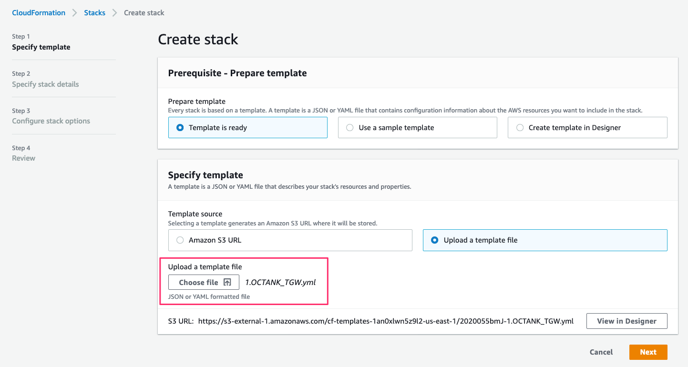
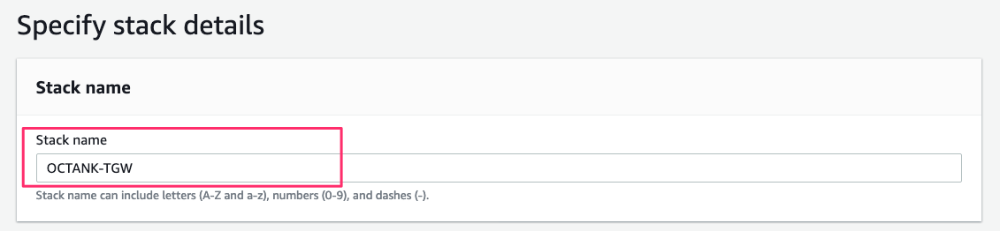
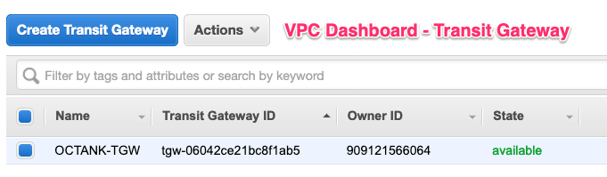
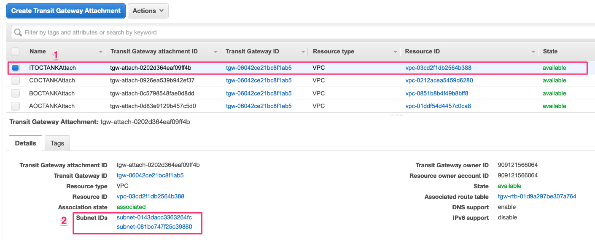
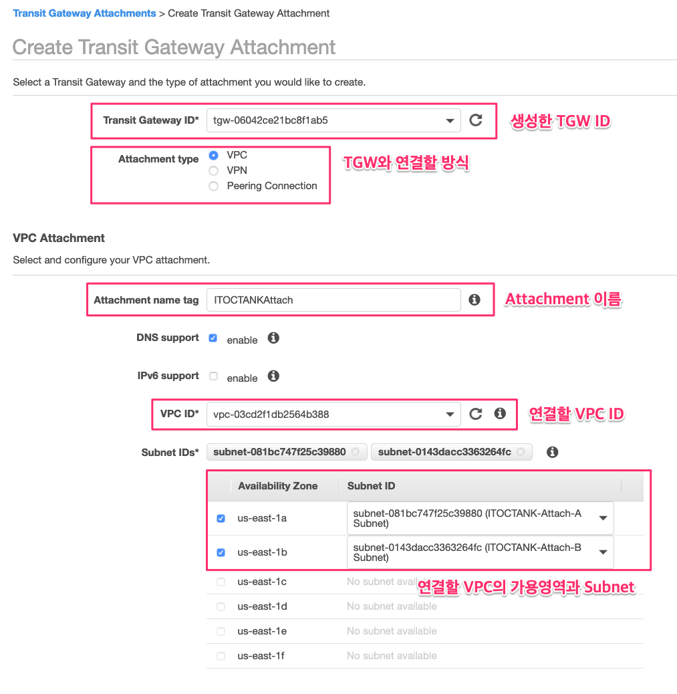
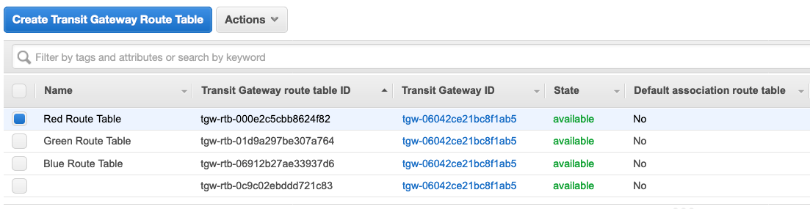
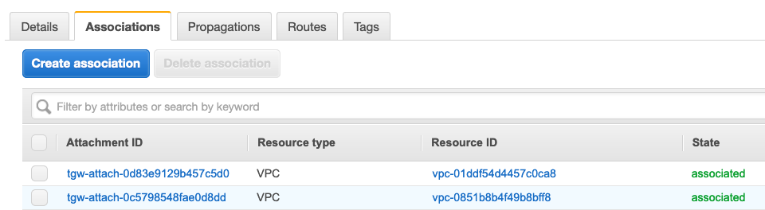
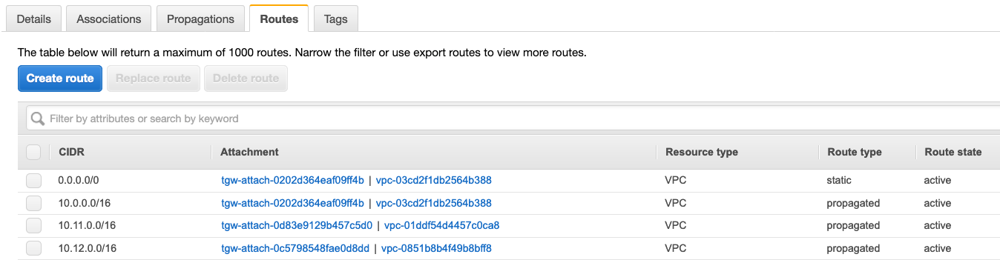

# 1.3 TGW 구성

### TGW Cloudformation 배포

[1.2 TGW를 위한 VPC 구성](1.2.tgw-vpc.md) 에서 처럼 사전에 구성된 Cloudformation으로 배포합니다. Cloudformation 파일은 "[1.OCTANK\_TGW.yml](https://github.com/whchoi98/TGW_CF/blob/master/1.AOCTANK.yml)"을 선택합니다.



Stack Name을 선언하고, Stack을 생성합니다.



transit gateway는 Hyperplane 기반으로 생성되므로 , 3분 정도의 시간 소요됩니다.  
해당 랩에서는 앞서 생성된 VPC들과 자동으로 연계하도록 구성되어 있습니다.  
Cloudformation이 정상적으로 구성되면 A,B,C,IT OCTANK가 자동으로 연결 구성됩니다.


TGW cloudformation에는 Transit Gateway Attachment 와 Transit Gateway Route Table 등이 자동으로 생성됩니다.


Cloudformation을 통해 정상적으로 배포가 되었다면, 아래와 같이 VPC Transit Gateway 메뉴에서 Transit Gateway 와 Transit Gateway Attachments, Route Table이 생성됩니다.



Transit Gateway Attachment는 아래와 같이 구성이 됩니다.  
앞서 4개의 VPC를 생성했고, 4개의 VPC에 대해 Attachment를 생성한 결과입니다.



Cloudformation으로 구성하지 않았다면 아래와 같이 수동으로 설정하게 됩니다.  
이 랩에서는 이러한 수동설정을 요구하지 않습니다.




TGW와 연결할 수 있는 방식은 3가지로 제공되며, 해당 랩에서는 모든 방법이 제공됩니다. VPC 연결방식과 VGW-CGW VPN 연결방식, 다른 TGW와의 연결 방식등이 제공됩니다.


Transit Gateway Route Table에서 연결된 VPC들에 대한 라우팅 구성을 확인합니다.



랩에서는 Red, Green, Blue Route Table을 구성했습니다.  
각 Route Table은 앞서 살펴본 Transit Gateway Attachment를 여러개 설정할 수 있으며, 또한 라우팅 테이블을 전파할 것인지, Static Route, Blackhole Route를 처리할 것인지 등을 설정할 수 있습니다.

아래 그림은 Cloudformation을 통해 설정된 Red Route Table에 2개의 VPC를 Attachment를 통해 연결한 것입니다. AOCTANK,BOCTANK VPC가 연결되어 있습니다.



Transit Gateway에 연결되면, 그룹화된 Route Table에 다른 VPC Routing Table을 선택적으로 전파할 수 있습니다. Red Route Table에는 아래와 같이 ITOCTANK,AOCTANK,BOCTANK Table등 3개의 VPC 네트워크을 전파합니다.


TGW Route Table에서는 Static Route와 Blackhole Route를 처리할 수 있습니다.  
Cloudformation을 통해 구성한 아래 Red Route Table에서는 0.0.0.0/0 \(Default Route\)에 대해서 모두 ITOCTANK VPC로 향하게 구성되어 있습니다.



### 각 VPC에서 EC2 통신 확인하기.

Transit Gateway와 VPC가 정상적으로 구성되어 동작되는지를 확인합니다.

Cloudformation Stack이 올바르게 구성되었다면, 각 VPC에는 System Manager 기반 Session Manager 접속을 위해 VPC Endpoint가 설치되며, EC2 Instance에는 IAM SSM Role이 부여되어 생성됩니다.  
랩에서 생성된 EC2 Instance 의 Private IP를 접속하기 위해서는 Bastion Server를 통해서 접속해야 합니다.  
하지만 관리상 불편하기 때문에, 랩에서는 Session Manager를 통해서 접속합니다.

아래와 같은 구성을 통해 콘솔에서 Private IP로 접속할 수 있습니다.


사전에 관리자 콘솔에서는 AWS CLI 가 설치되어 있어야 하며, 랩에서는 맥 OS 기반에서 AWS CLI SSM Plugin을 설치하여 사용하는 예를 제공합니다.


aws cli ssm plugin 설치

```text
brew tap dkanejs/aws-session-manager-plugin
brew install aws-session-manager-plugin
```

VPC 에 설치된 EC2 Instance의 id를 아래와 같은 AWS CLI 명령을 통해 확인합니다.

```text
aws ec2 describe-instances --query 'Reservations[].Instances[].[Tags[?Key==`Name`] | [0].Value, Placement.AvailabilityZone,InstanceId, InstanceType, ImageId,State.Name, PrivateIpAddress, PublicIpAddress ]' --output table
--------------------------------------------------------------------------------------------------------------------------------------------
|                                                             DescribeInstances                                                            |
+-------------------+-------------+----------------------+-----------+------------------------+----------+----------------+----------------+
|  COCTANK-Server-A |  us-east-1a |  i-0b64691c3d92ab0d7 |  t3.small |  ami-0175605caef730e00 |  running |  10.21.14.100  |  None          |
|  ITOCTANK-Server-A|  us-east-1a |  i-0b8c62bb05385d50a |  t3.small |  ami-0175605caef730e00 |  running |  10.0.14.100   |  None          |
|  AOCTANK-Server-A |  us-east-1a |  i-0280834c029847bd2 |  t3.small |  ami-0175605caef730e00 |  running |  10.11.14.100  |  None          |
|  ITOCTANK-Bastion |  us-east-1a |  i-09d50e0c45df23897 |  t3.small |  ami-0175605caef730e00 |  running |  10.0.3.217    |  54.86.188.56  |
|  BOCTANK-Server-A |  us-east-1a |  i-0dfcc7cb10a0a73d2 |  t3.small |  ami-0175605caef730e00 |  running |  10.12.14.100  |  None          |
|  AOCTANK-Server-B |  us-east-1b |  i-0fa6d818b6c1ae0ea |  t3.small |  ami-0175605caef730e00 |  running |  10.11.22.100  |  None          |
|  ITOCTANK-Server-B|  us-east-1b |  i-042f6fccff02e7d5f |  t3.small |  ami-0175605caef730e00 |  running |  10.0.22.100   |  None          |
|  COCTANK-Server-B |  us-east-1b |  i-0407a9b2ec9fb6591 |  t3.small |  ami-0175605caef730e00 |  running |  10.21.22.100  |  None          |
|  BOCTANK-Server-B |  us-east-1b |  i-04b426b154a9fbdea |  t3.small |  ami-0175605caef730e00 |  running |  10.12.22.100  |  None          |
+-------------------+-------------+----------------------+-----------+------------------------+----------+----------------+----------------+
```

IT OCTANK의 EC2 instance와 A,B,C OCTANK Instance간의 트래픽이 정상적으로 연결되는지 PING을 통해 확인합니다. 또한 IT OCTANK에서 제공하는 NAT G.W를 통해 인터넷 서비스가 정상적으로 이뤄지는지 확인합니다.


각 EC2 instance 에 host file을 편집하여 네트워크 통신을 간편하게 확인합니다.


/etc/hosts file 추가 또는 편집 \(생략해도 랩을 진행하는데는 이슈가 없습니다.\)

```text
# Host file for the Hybrid Networking 
10.0.14.100    ITSVR-A
10.0.22.100    ITSVR-B
10.11.14.100   ASVR-A
10.11.22.100   ASVR-B
10.12.14.100   BSVR-A
10.12.22.100   BSVR-B
10.21.14.100   CSVR-A
10.21.22.100   CSVR-B
10.1.14.100    DSVR-A
10.1.22.100    DSVR-B
10.31.14.100   FSVR-A
10.31.22.100   FSVR-B
10.5.14.100    ZSVR-A
10.5.22.100    ZSVR-B
```

아래와 같이 SSM\(System Session Manager\)를 통해 Private IP로 할당된 각 VPC EC2 인스턴스에 접속합니.



```text
aws ssm start-session --target i-0b8c62bb05385d50a
```



```
aws ssm start-session --target i-0280834c029847bd2
```



```
aws ssm start-session --target i-0dfcc7cb10a0a73d2
```



```
aws ssm start-session --target i-0407a9b2ec9fb6591
```



각 VPC EC2 인스턴스에서 네트워크 연결 상태를 확인 합니다.



```text
[ec2-user@ip-10-0-14-100 ~]$ ./pingshell.sh
Tue Feb 25 05:25:06 UTC 2020
target www.aws.com is up
target ITSVR-A is up
target ITSVR-B is up
target ASVR-A is down
target ASVR-B is down
target BSVR-A is down
target BSVR-B is down
target CSVR-A is down
target CSVR-B is down
target DSVR-A is down
target DSVR-B is down
target FSVR-A is down
target FSVR-B is down
target ZSVR-A is down
target ZSVR-B is down
```



```text
[ec2-user@ip-10-11-14-100 ~]$ ./pingshell.sh
Tue Feb 25 00:54:43 UTC 2020
node www.aws.com is down
node ITSVR-A is down
node ITSVR-B is down
node ASVR-A is up
node ASVR-B is up
node BSVR-A is down
node BSVR-B is down
node CSVR-A is down
node CSVR-B is down
node DSVR-A is down
node DSVR-B is down
node FSVR-A is down
node FSVR-B is down
node ZSVR-A is down
node ZSVR-B is down
```



```text
[ec2-user@ip-10-11-22-100 ~]$ ./pingshell.sh
Tue Feb 25 03:56:11 UTC 2020
node www.aws.com is down
node ITSVR-A is down
node ITSVR-B is down
node ASVR-A is up
node ASVR-B is up
node BSVR-A is down
node BSVR-B is down
node CSVR-A is down
node CSVR-B is down
node DSVR-A is down
node DSVR-B is down
```



```text
[ec2-user@ip-10-21-14-100 ~]$ ./pingshell.sh
Tue Feb 25 05:37:38 UTC 2020
target www.aws.com is down
target ITSVR-A is down
target ITSVR-B is down
target ASVR-A is down
target ASVR-B is down
target BSVR-A is down
target BSVR-B is down
target CSVR-A is up
target CSVR-B is up
target DSVR-A is down
target DSVR-B is down
target FSVR-A is down
target FSVR-B is down
target ZSVR-A is down
target ZSVR-B is down
```



A OCTANK에서는 동일 CIDR 주소에 등록된 서버로만 통신이 가능합니다.

* A OCTANK 의 EC2 인스턴스들은 인터넷 또는 외부 VPC와 통신이 불가능합니다.

B OCTANK에서 확인

* 먼저 SSM을 통해 B OCTANK 의 사설 IP가 할당되어 있는 EC2 인스턴스에 접속합니다.
* B OCTANK에서는 동일 CIDR 주소에 등록된 서버로만 통신이 가능합니다.
* B OCTANK 의 EC2 인스턴스들은 인터넷 또는 외부 VPC와 통신이 불가능합니다.

C OCTANK에서 확인

* 먼저 SSM을 통해 C OCTANK 의 사설 IP가 할당되어 있는 EC2 인스턴스에 접속합니다.
* C OCTANK에서는 동일 CIDR 주소에 등록된 서버로만 통신이 가능합니다.
* C OCTANK 의 EC2 인스턴스들은 인터넷 또는 외부 VPC와 통신이 불가능합니다.

A,B,C OCTANK VPC는 인터넷으로 향하는 트래픽과 다른 VPC와의 연동을 TGW를 통해 사용되도록 되어 있습니다. 각 VPC에서 네트워크가 되지 않는 이유를  ["1.4 TGW기반의 트래픽 제어"](1.4.tgw-vpc-traffic-control.md) 랩에서 확인해 봅니다.

