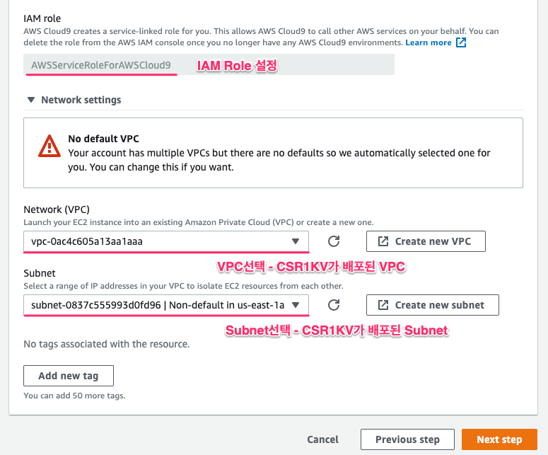

# 2.2 VGW-CGW 연결 구성

### AWS Cloud9 기반의 CGW 구성

CGW\(Customer Gateway\)에 LAB에서 처럼 Public IP로 할당이 가능하지만, 다른 EC2 처럼 사설 IP로 연결 구성 할 수도 있습니다. 이 랩에서는 AWS Cloud9을 통해 기본 제공되는 Cisco CSR1KV 라우터의 기본 템플릿을 손쉽게 변경해서 배포하는 방법을 제공합니다.

먼저 Cloud 9을 생성합니다. \(AWS Cloud9 서비스에서 아래와 같이 구성을 시작합니다.\)

![\[&#xADF8;&#xB9BC; 2.2.1 Cloud9 &#xC0DD;&#xC131;\]](../.gitbook/assets/2.1.13.c9.png)

IDE환경의 이름을 정의합니다.

![\[&#xADF8;&#xB9BC; 2.2.2 IDE &#xC774;&#xB984; &#xC815;&#xC758;\]](../.gitbook/assets/2.1.14.c9.png)

IDE 환경을 아래와 같이 구성합니다.

![\[&#xADF8;&#xB9BC; 2.2.2 Cloud9 &#xC0DD;&#xC131;\]](../.gitbook/assets/2.1.15.c9.png)

### VGW-CGW 연결 구성하기

