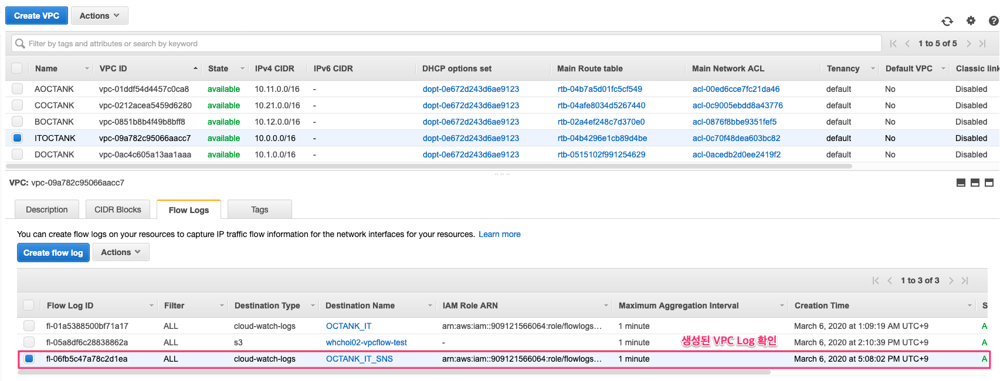

# 5.4.VPC Flow 기반 모니터링2

### VPC Flow, S3, Athena, QuickSight 기반 모니터링 구성 소개

![\[&#xADF8;&#xB9BC; 5.4.1 VPC Flow &#xBAA8;&#xB2C8;&#xD130;&#xB9C1;&#xC744; &#xC704;&#xD55C; S3, Athena, QuickSight &#xAD6C;&#xC870;\] ](../.gitbook/assets/5.4.1.vpcflow_s3_athena_quicksight.png)

### VPC Flow, S3 구성

![\[&#xADF8;&#xB9BC; 5.4.2 S3 Bucket &#xC0DD;&#xC131;&#xD558;&#xAE30;\]](../.gitbook/assets/5.4.2.s3_bucket_create.png)

![\[&#xADF8;&#xB9BC; 5.4.3 S3 Bucket &#xC0DD;&#xC131; &#xD655;&#xC778;\]](../.gitbook/assets/5.4.3.s3_bucket_create2.png)

![\[&#xADF8;&#xB9BC; 5.4.4 S3 Bucket ARN &#xBCF5;&#xC0AC; &#xD574; &#xB450;&#xAE30;\]](../.gitbook/assets/5.4.4.s3_bucket_arn.png)

![\[&#xADF8;&#xB9BC; 5.4.5 VPC&#xC5D0;&#xC11C; Flow log &#xC0DD;&#xC131;&#xD558;&#xAE30;1\]](../.gitbook/assets/5.4.5.create_vpc_flow.png)

![\[&#xADF8;&#xB9BC; 5.4.6 VPC&#xC5D0;&#xC11C; Flow log &#xC0DD;&#xC131;&#xD558;&#xAE30;2\]](../.gitbook/assets/5.4.6.create_vpc_flow2.png)

![\[&#xADF8;&#xB9BC; 5.4.7 CloudWatch Log Group &#xC0DD;&#xC131;&#xD558;&#xAE30;1\]](../.gitbook/assets/5.4.7.cw_group_create.png)

![\[&#xADF8;&#xB9BC; 5.4.8 CloudWatch Log Group &#xC0DD;&#xC131;&#xD558;&#xAE30;2\]](../.gitbook/assets/5.4.8.vpc_flow_log1.png)

### Athena 구성

### QuickSight 구성

